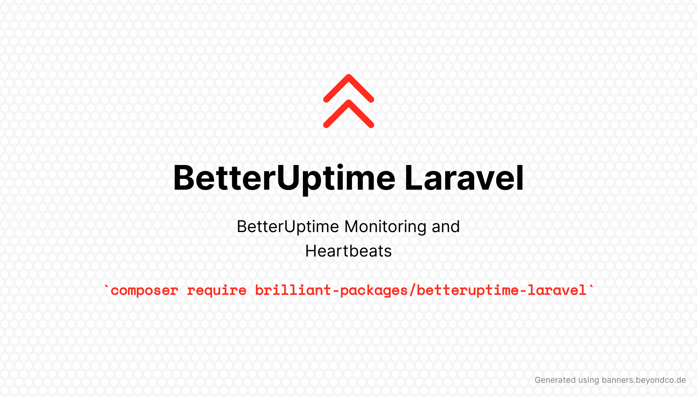

# Laravel BetterUptime

[](https://packagist.org/packages/brilliant-packages/betteruptime-laravel)
[](https://packagist.org/packages/brilliant-packages/betteruptime-laravel)


This packages provides a route for BetterUptime to monitor and excludes it from Telescope monitoring.

It also enables BetterUptime heartbeat monitoring.



## Installation

You can install the package via composer:

```bash
composer require brilliant-packages/betteruptime-laravel
```

You can publish the config file with:
```bash
php artisan vendor:publish --provider="BrilliantPackages\BetterUptimeLaravel\BetterUptimeLaravelServiceProvider" --tag="betteruptime-laravel-config"
```

This is the contents of the published config file:

```php
return [
    'monitor' => [
        'enabled' => env('BETTER_UPTIME_MONITOR_ENABLED', true),
        'path' => env('BETTER_UPTIME_MONITOR_PATH', 'better-uptime'),
    ],

    'heartbeat' => [
        'enabled' => env('BETTER_UPTIME_HEARTBEAT_ENABLED', true),
        'url' => env('BETTER_UPTIME_HEARTBEAT_URL'),
        'minutes' => env('BETTER_UPTIME_HEARTBEAT_FREQUENCY', '5'),
    ],
];
```

## Usage

## Monitoring

Create a BetterUptime monitor using `https://{yourDomain}/better-uptime` as the URL (you can change the path using the `BETTER_UPTIME_MONITOR_PATH` environment variable).

You can either set BetterUptime to alert you when it “Becomes unavailable” or “Doesn’t contain keyword”; if you choose the keyword method, use your app’s name (`APP_ENV` environment variable) or “BetterUptime” as the keyword.

To disable the route, set `BETTER_UPTIME_MONITOR_ENABLED=false`.

## Heartbeat

Create a BetterUptime heartbeat monitor with your desired name, frequency, and grace period.

Determine the frequency in minutes (e.g., 1 hour = 60, 1 day = 1440, etc.) and set these environment variables:

```
BETTER_UPTIME_HEARTBEAT_URL=https://betteruptime.com/api/v1/heartbeat/abc123
BETTER_UPTIME_HEARTBEAT_FREQUENCY=5
```

To disable heartbeat monitoring, remove the `BETTER_UPTIME_HEARTBEAT_URL` or set `BETTER_UPTIME_HEARTBEAT_ENABLED=false`.

## Testing

```bash
composer test
```

## Changelog

Please see [CHANGELOG](documentation/CHANGELOG.md) for more information on what has changed recently.

## Contributing

Please see [CONTRIBUTING](.github/CONTRIBUTING.md) for details.

## Security Vulnerabilities

Please review [our security policy](../../security/policy) on how to report security vulnerabilities.

## Credits

- [LuminFire](https://luminfire.com)
- [Andrew Minion](https://andrewrminion.com/)
- [All Contributors](../../contributors)

## License

The MIT License (MIT). Please see [License File](LICENSE.md) for more information.
